# 16x16 Wallace Tree Multiplier

The multiplier consists of three stages:

1. Partial Product Generator
2. Partial Product Accumulator
3. Final Stage Adder

In order to synthesize .sv files in OpenLane `sv2v` program is used to convert SystemVerilog to Verilog. 

## Partial Product Generator

### Synthesis of PPG

PPG hierarchy schematic. The hierarchy schematic shows `shl` and `BUF` modules in addition to AND gates.

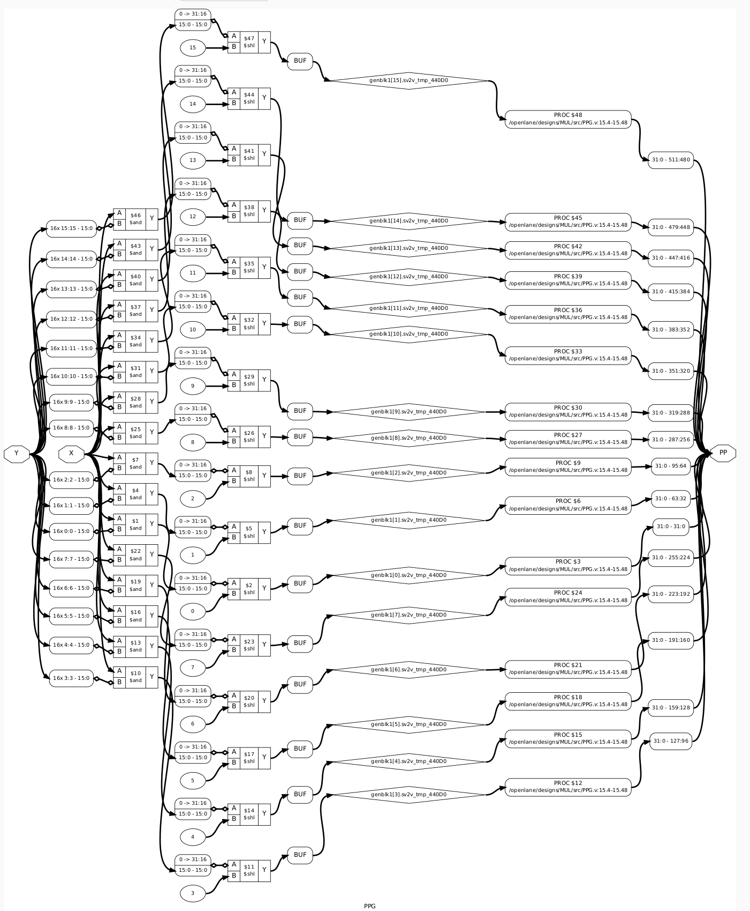

PPG post_techmap schematic is a large file so its cropped from the center to fit.
The post_techmap shows only AND gates. The PP unpacked array can be seen at the output.

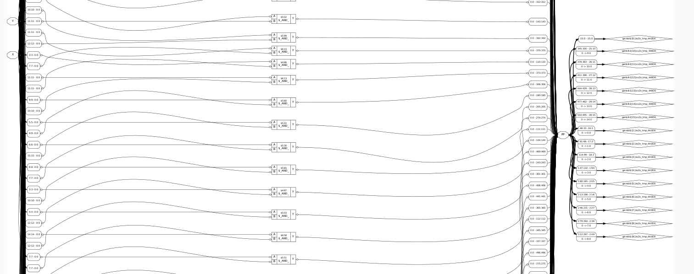

### Simulation of PPG

Simulation of PPG can be seen in Figures.

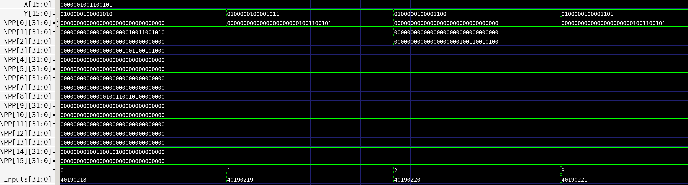

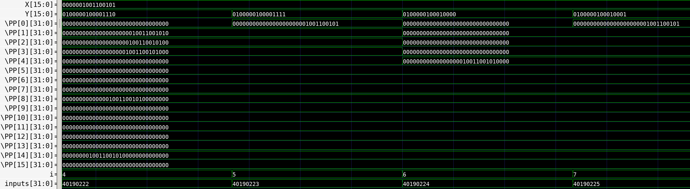

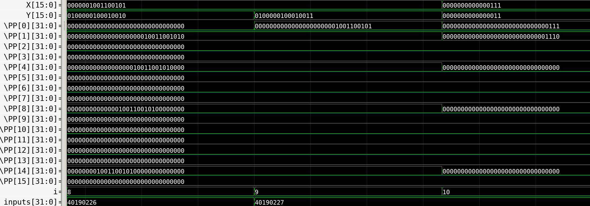

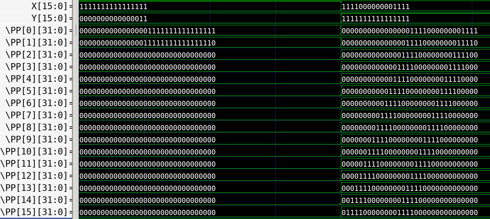

## Compressor 4:2

### Synthesis of Compressor 4:2

Compressor hierarchy schematic. Two full adders are used.

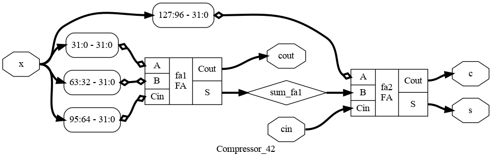

Because Compressor works with 32 bit integers, there is a lot of components synthesised in the post tech map of Compressor.
Among the elements used are:

- NAND
- ANDNOT
- XNOR
- OR
- NOT

## Simulation of Compressor 4:2

Simulation of Compressor can be seen in Figure.

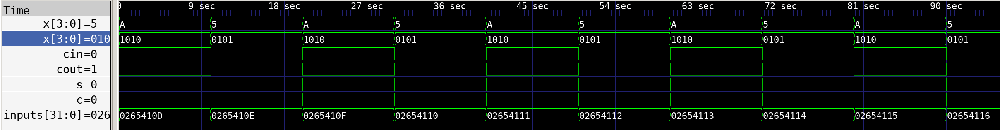

## Partial Product Accumulator

### Synthesis of PPA

PPA hierarchy schematic. Mainly Compressor modules are present. BUF and connector type elements can be seen as well.

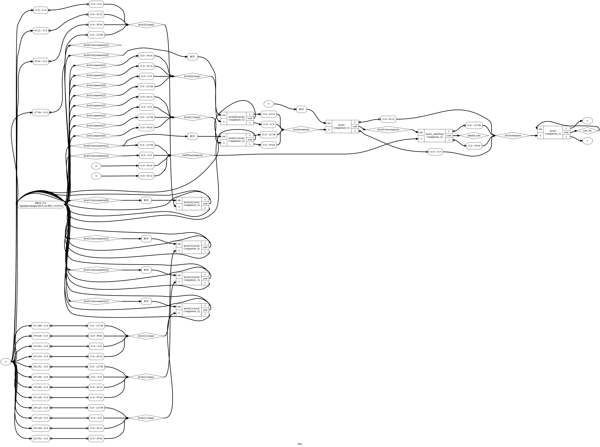

### Simulation of PPA

Simulation of PPA can be seen in Figure.

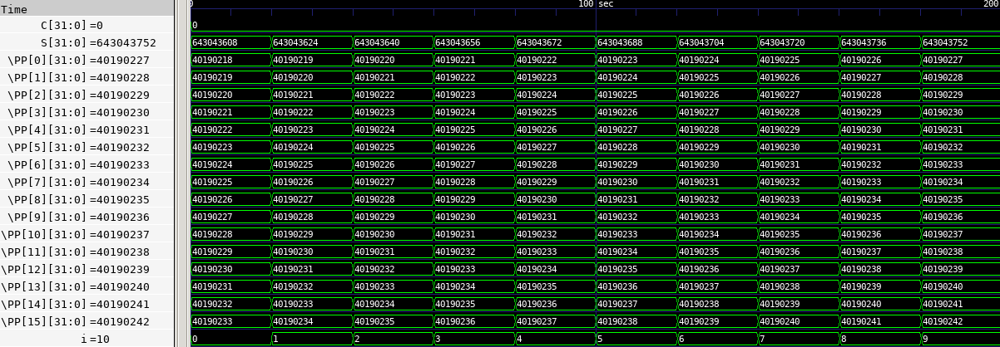

## Ripple Carry Adder

Ripple Carry Adder is an adder topology where the carry input and outputs of full adders are chained. Like a ripple, the carry is propagated from the first full adder to the last.

### Synthesis of RCA

RCA hierarchy schematic can be seen in Figure. 

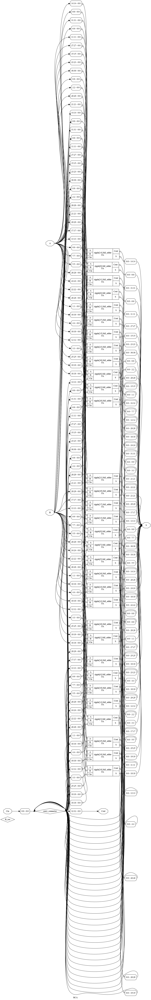

In post_techmap, elements used in RCA are similar to Compressor, which has Full Adders as well. 

- ANDNOT
- XOR
- XNOR

### Simulation of RCA

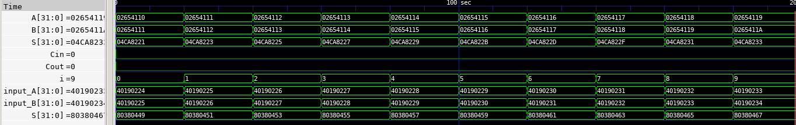

## Multiplier / Top Module

### Synthesis of Multiplier

Multiplier hierarchy schematic in Figure.

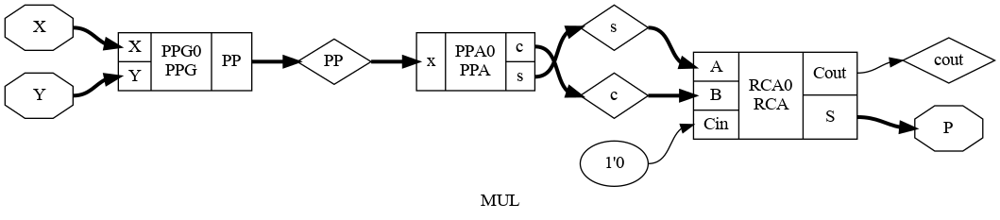

A huge post_techmap is produced as a result. The elements mentioned in the previous modules are used as this is the top module.

### Simulation of Multiplier

Random 100000 inputs are used and both behavioural and post sythesis functional simulation passes all the tests.

#### Behavioural Simulation

Simulation of Multiplier can be seen in Figure.

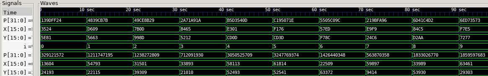

#### Post-Synthesis Functional Simulation

It can also be seen from the waveform that the circuit is still functionally correct after synthesis.

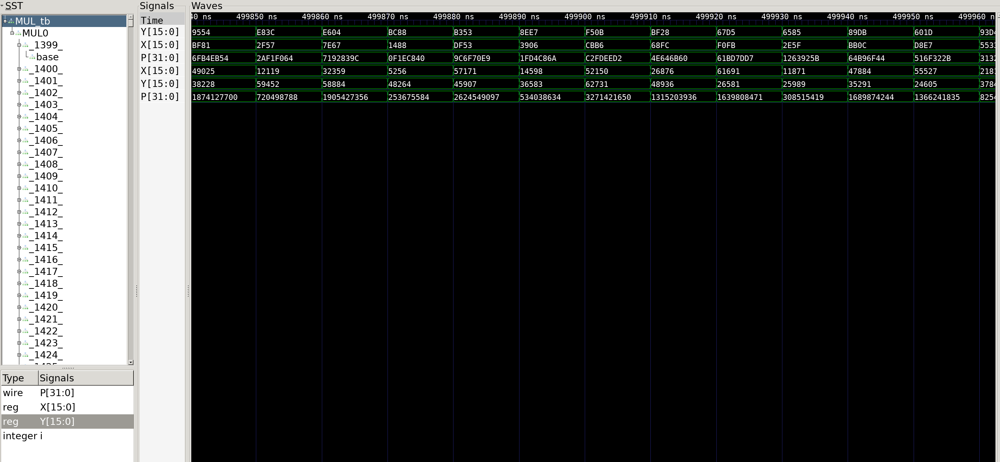
